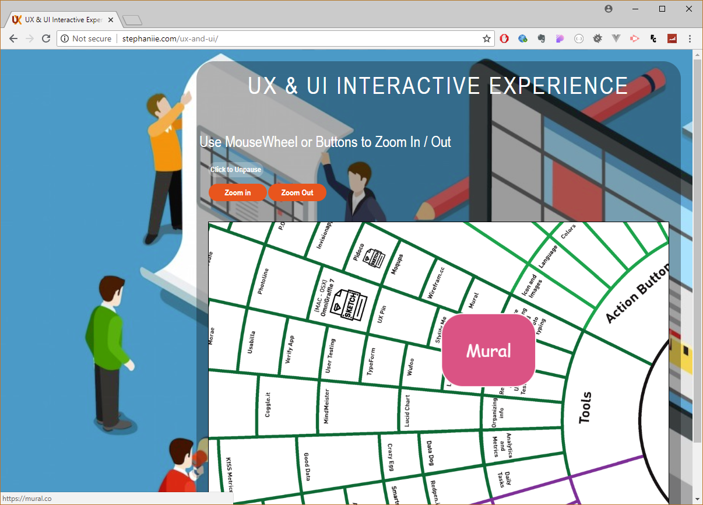

# UX-and-UI - Interactive Experience

Important. Infographic is created by Bankai - https://medium.com/@bankai_ux/the-elements-of-ux-ui-visualized-5140254a8b76 . 

An Interactive Map of UI Tools, UX Elements and General Strategies. The Map uses Zoom functions to get a better overview of each element. Most element has clickable links to webpages designed for prototyping, user testing, analytics and metrics, wireframing plus a couple of quick tip how to dig deeper into this spectrum. 

The website is built on
Bootstrap
Hammer.js
Colorbox.js
Zoomable.js
and iframes.

## Images
### Overview

### (Mural) Wire Framing Tool 

